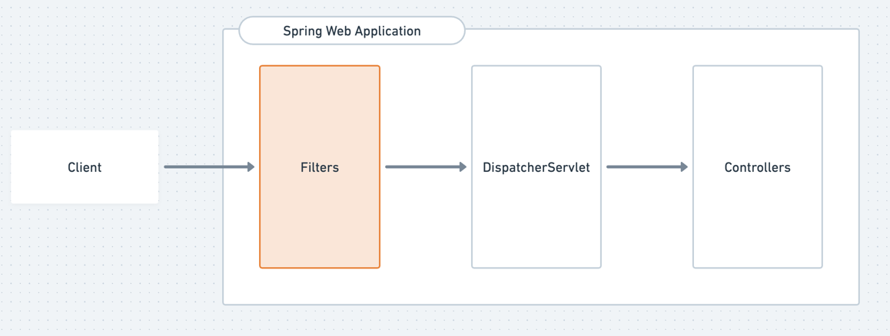
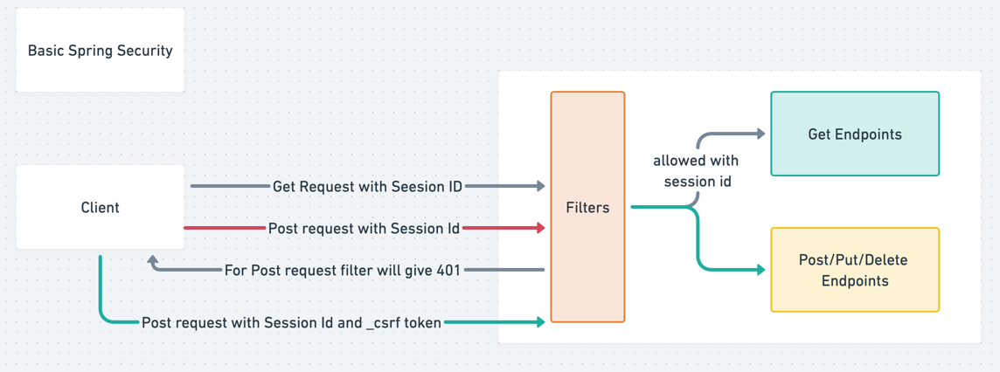

# Basic Spring Security Implementation

## How to add Spring security to your project?
1. Add the Spring Security dependency to your `pom.xml` file:
```xml
<dependency>
    <groupId>org.springframework.boot</groupId>
    <artifactId>spring-boot-starter-security</artifactId>
</dependency>
```

- By adding this you will be able to set up a basic auth where when you try to access your controller api then spring security will ask to first authenticate.
- Spring security will create a default user with username `user` and a random password. You can find the password in the console logs when you run your application. It will look something like this:
```
Using generated security password: 12345678-1234-1234-1234-123456789012
```

## Let's Understand Te Basics about How it does so?

You see, we are just adding dependency and Spring security is already in action, In spring boot application the entry point to the application is DispatcherServlet
(It has all the mapping about the controller and when a request come then DispatcherServlet decides which controller will handle that request). In Spring-boot there is another layer or you can say 
a middleware where Spring security will intercept the request before it reaches the DispatcherServlet.

- So when you add the Spring security dependency, it will automatically add a filter to the filter chain of the application. This filter will intercept all the requests and check if the user is authenticated or not.
- If the user is not authenticated, it will redirect the user to the login page.
- If the user is authenticated, it will allow the request to go through to the DispatcherServlet.
- This is how Spring security works by default. It will create a default user with username `user` and a random password. You can find the password in the console logs when you run your application. It will look something like this:
```
Using generated security password: 12345678-1234-1234-1234-123456789012
```


when you login using your username and generated password then it stores a session id in you browser and based on the session id you are authenticated for the next time.

## Why Post request is not working and What is CSRF?
- The reason is that Spring security will only allow GET requests to go through by default. So if you try to send a POST request, it will not work.
- This is because of CSRF (Cross-Site Request Forgery) protection. CSRF is a type of attack that tricks the user into submitting a request to a different site without their knowledge.
- To protect against this, Spring security will only allow GET requests to go through by default. If you want to allow POST requests, you need to disable CSRF protection or you need to pass the CSRF token in header.




- Basically what happens is when you Log in a browser then your session id is stored in the cookies and when you make a request to the server then the server will check if the session id is present in the cookies or not. If it is present then it will allow the request to go through. If it is not present then it will redirect you to the login page.
- But in case of post request, the server will check if the CSRF token is present in the request or not. If it is present then it will allow the request to go through. If it is not present then it will redirect you to the login page.

- So in order to make the post request work, you need to disable CSRF protection, or you need to pass the CSRF token in the header.
- CSRF Token will make sure that the request is coming from the same site and not from any other site. So it will check if the CSRF token is present in the request or not. If it is present then it will allow the request to go through. Because you can add Session id in different browsers and it will not work. So CSRF token is used to make sure that the request is coming from the same site and not from any other site.
## How do I Get the CSRF token?

```java
@GetMapping("/csrf")
    public CsrfToken getToken(HttpServletRequest request){
        return (CsrfToken) request.getAttribute("_csrf");
    }
```

- Now If you see we are getting csrf token from request, and we are returning it as a response. So now you can use this token in your post request.

**Now the question is if it's coming in request then why we are not able to do the post request?**

- **Client Responsibility** : The inclusion of the CSRF token in POST requests is the responsibility of the client-side code. Spring Security does not automatically inject the token into POST requests because it assumes that the developer will handle this explicitly.
- **Security Design** : Automatic inclusion could introduce security risks if not handled properly. For example, if the token is exposed in a way that allows attackers to intercept it, the protection mechanism becomes ineffective.
- **Explicit Handling** : By requiring developers to explicitly include the CSRF token, Spring Security ensures that developers are aware of the security implications and implement proper measures.
     
## Steps to take the Request With CSRF Token

1. **Get the CSRF Token**: You can get the CSRF token from the server using a GET request. The server will return the CSRF token in the response.
2. **Include the CSRF Token in the POST Request**: You need to include the CSRF token in the header of the POST request. You can do this using JavaScript or any other client-side code.
3. **Send the POST Request**: After including the CSRF token in the header, you can send the POST request to the server. The server will check if the CSRF token is present in the request or not. If it is present then it will allow the request to go through. If it is not present then it will redirect you to the login page.

```curl
curl -X 'POST' \
  'http://localhost:9000/api/v1/cache/saveWithoutTTL' \
  -H 'accept: */*' \
  -H 'X-CSRF-TOKEN: 3-zovgT2JlzWSIJcZaQTVlejyVcq7PcSXF-_WdRo4AfCPcVY6NSL3zPAQzj7cOBuUYknYWSb5G8ficc_OmreYOULhGTzCPVu' \
  -H 'Content-Type: application/json' \
  -d '{
  "key": "test1",
  "value": "tested once",
  "ttl": 0,
  "timeUnit": "NANOSECONDS"
}'
```
- Previously we were not able to do the post request because we were not passing the CSRF token in the header. So now we are passing the CSRF token in the header, and it is working fine.

`Wooo Hooo` We have Completed the Basic Spring Security Implementation. Now we can move to the next step where we will be implementing Custom User and Custom Password based authentication.

[User Based Authentication](User_Authentication.md)